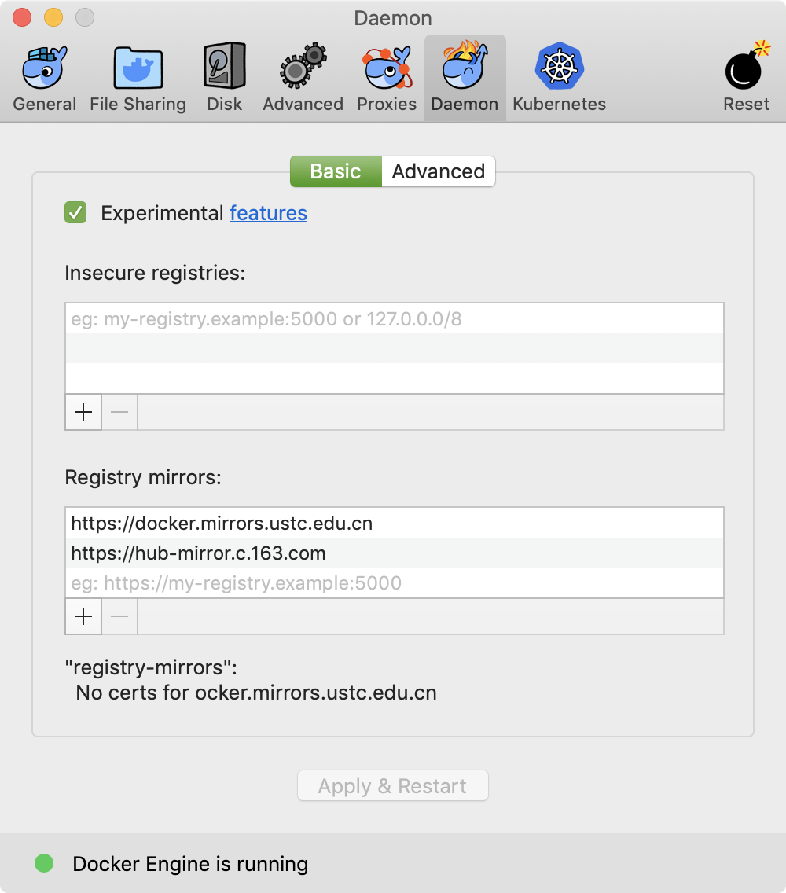

## docker for mac 仓库镜像配置

## 网络资源
> 中央仓库: https://hub.docker.com/r/oracleinanutshell/oracle-xe-11g

## 我的镜像
docker run -d -p 1521:1521 -p 49160:22 oracleinanutshell/oracle-xe-11g

## docker 常用命令
> docker info 查看docker信息
